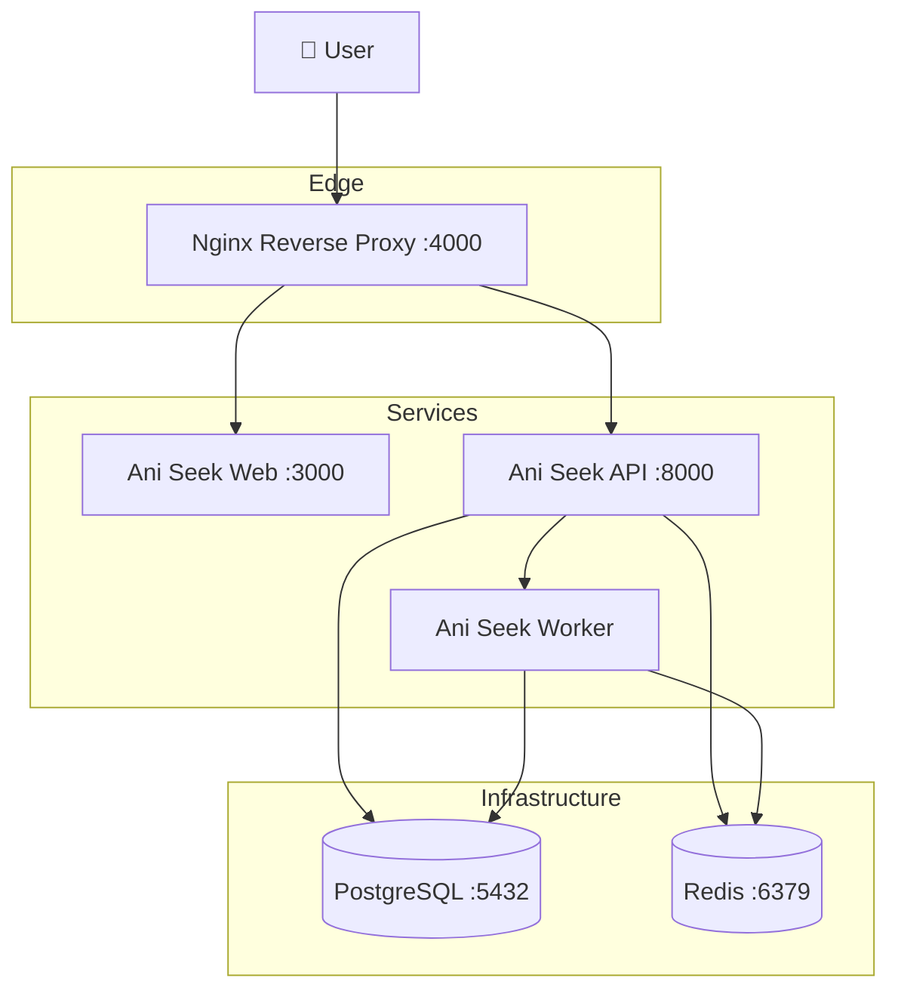
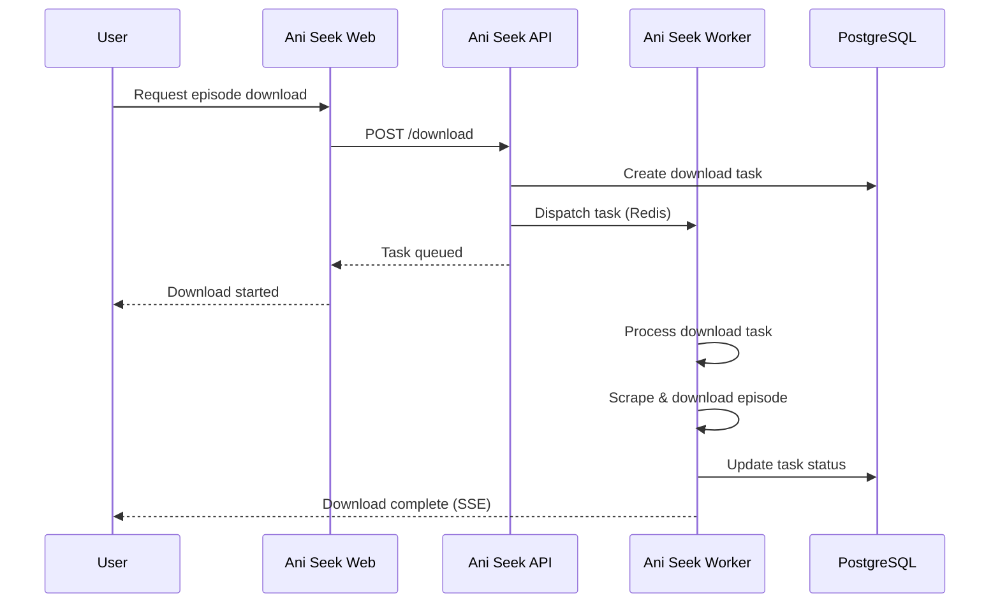

# Ani Seek

## Disclaimer

This project is intended for **educational purposes only**. The scraping functionality is designed to work with anime sources that permit such access. Users are responsible for ensuring compliance with applicable laws and the terms of service of the websites being scraped. The author assumes no liability for any misuse of this software.

## Author

- [Jonathan García](https://github.com/ElPitagoras14) - Computer Science Engineer

## Description

Ani Seek is a comprehensive system for scraping, managing, and streaming anime content. This monorepo is structured around three main components:

- **Ani Seek Web**: Frontend web application built with Next.js. Provides the user interface for browsing, searching, and managing anime collections.
- **Ani Seek API**: Backend REST API built with FastAPI. Handles authentication, data management, and dispatches scraping tasks to workers.
- **Ani Seek Worker**: Background processing service built with Dramatiq. Handles heavy operations like web scraping and episode downloads.

## Technologies

- **Backend**: Python 3.10, FastAPI, PostgreSQL, Redis, Dramatiq, ani-scrapy
- **Frontend**: Next.js 15, React 19, TypeScript, NextAuth.js
- **DevOps**: Docker, Docker Compose, GitHub Actions

## Quick Start

```bash
docker compose up -d
```

Access the application at: **http://localhost:4000**

A more robust configuration is available in `compose.yaml`.

## Architecture

This diagram illustrates the high-level architecture of Ani Seek, showing how the different components interact within the Docker network.



## Download Flow

This sequence diagram shows the typical flow when a user requests to download an anime episode, from the frontend request to the worker processing the download.



## Ports

| Service    | Port | Exposure |
| ---------- | ---- | -------- |
| Nginx      | 4000 | External |
| Web        | 3000 | Internal |
| API        | 8000 | Internal |
| PostgreSQL | 5432 | Internal |
| Redis      | 6379 | Internal |

**Nginx Routing:**

- `/` → Routes to frontend (Next.js)
- `/api/v1/` → Routes to backend API (FastAPI)
- `/sse/` → Routes to backend for Server-Sent Events

---

## Development

### Ani Seek API

Backend REST API built with FastAPI. Handles authentication, anime data management, and dispatches scraping tasks to workers.

```bash
# Navigate to the backend directory
cd backend

# Install dependencies using uv (or pip if preferred)
uv sync

# Start the development server with auto-reload
uv run src/main.py
```

### Ani Seek Worker

Background processing service built with Dramatiq. Consumes tasks from Redis to perform web scraping and episode downloads.

```bash
# Navigate to the queue directory
cd queue

# Install dependencies using uv
uv sync

# Start the worker with 2 processes and 4 threads each
uv run dramatiq main --processes 2 --threads 4
```

### Ani Seek Web

Frontend web application built with Next.js. Provides the user interface for browsing and managing anime content.

```bash
# Navigate to the frontend directory
cd frontend

# Install project dependencies
npm install

# Start the development server with hot-reload
npm run dev
```

### Docker Services for Development

For local development without Docker, you need PostgreSQL and Redis running. Start only the required services:

```bash
# Start PostgreSQL and Redis containers in detached mode
docker compose up postgres redis -d
```

These services are required for the API and Worker to function properly.

### Environment Variables

Copy `.env.example` to `.env` and configure your environment:

```bash
# Create .env from the example file
cp .env.example .env
```

Edit `.env` with your local settings (database credentials, secrets, etc.). See `.env.example` for available options.

## Deployment

Currently, this project is designed for **local deployment only** and does not support HTTPS natively. For production deployments:

- Configure a reverse proxy (nginx, Traefik, etc.)
- Or use a service like Cloudflare to handle HTTPS termination

The containers should be placed behind a secure proxy for any internet-facing deployment.
