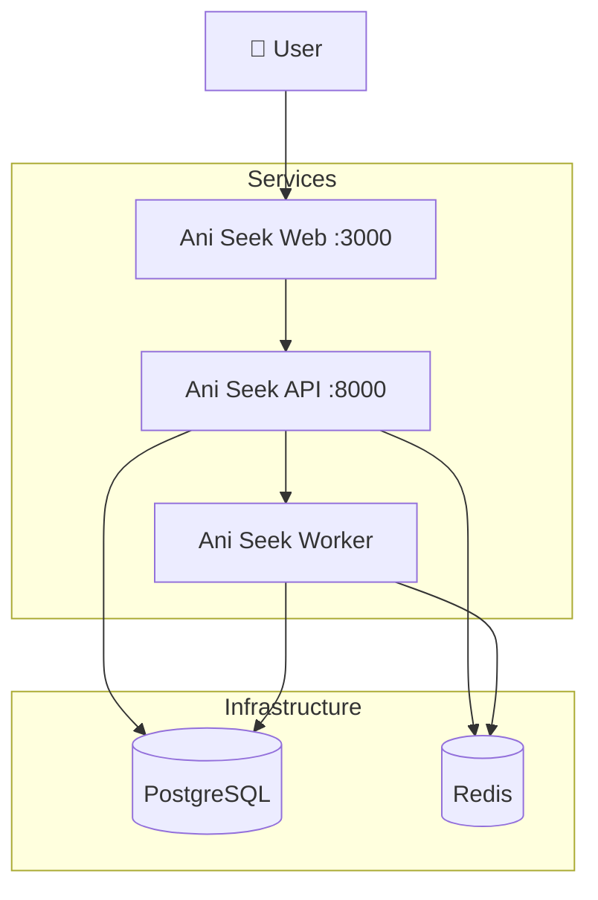
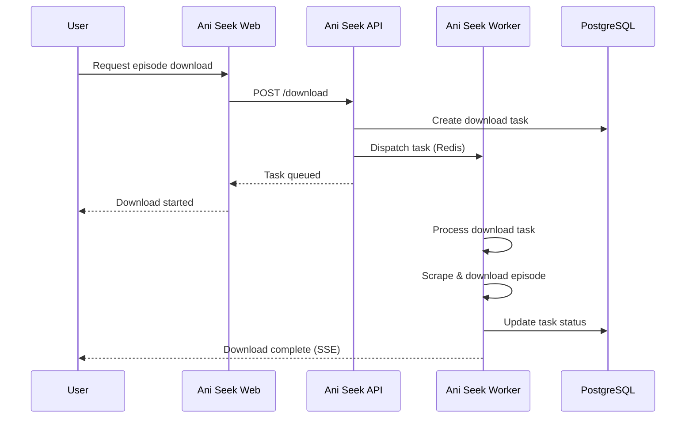

# Ani Seek

## Disclaimer

This project is intended for **educational purposes only**. The scraping functionality is designed to work with anime sources that permit such access. Users are responsible for ensuring compliance with applicable laws and the terms of service of the websites being scraped. The author assumes no liability for any misuse of this software.

## Author

- [Jonathan García](https://github.com/ElPitagoras14) - Computer Science Engineer

## Description

Ani Seek is a comprehensive system for scraping, managing, and downloading anime content. This monorepo is structured around three main components:

- **Ani Seek Web**: Frontend web application built with React + Vite. Provides the user interface for browsing, searching, and managing anime content.
- **Ani Seek API**: Backend REST API built with FastAPI. Handles authentication, data management, and dispatches scraping tasks to workers.
- **Ani Seek Worker**: Background processing service built with Dramatiq. Handles heavy operations like web scraping and episode downloads.

## Demo

<video src="https://github.com/user-attachments/assets/c6555beb-edcf-4ed9-956c-2a3472832024" controls width="100%"></video>

## Features

- **Search** — search anime by title with live scraping from AnimeAV1
- **Save** — bookmark animes to your personal list for quick access
- **Calendar** — see your saved animes currently in emission, organized by day of the week
- **Downloads** — download individual episodes or entire seasons in bulk, with real-time progress via Server-Sent Events
- **Download history** — browse and manage all your downloaded episodes
- **Storage** — monitor disk usage per anime and delete stored episodes
- **Dashboard** — overview of download stats, recent episodes, and storage consumption
- **Profile** — update your username and password

## Technologies

- **Backend**: Python 3.12, FastAPI, PostgreSQL, Redis, Dramatiq, ani-scrapy
- **Frontend**: React 19, Vite, TypeScript, TanStack Router, TanStack Query, shadcn/ui
- **DevOps**: Docker, Docker Compose, GitHub Actions

## Architecture



## Download Flow



## Environment Variables

Copy `.env.example` to `.env` and fill in your values. Variables marked **required in prod** must be changed before any internet-facing deployment.

### Infrastructure

| Variable | Description | Default |
| --- | --- | --- |
| `POSTGRES_USER` | PostgreSQL username | `postgres` |
| `POSTGRES_PASSWORD` | PostgreSQL password | `postgres` |
| `POSTGRES_DB` | PostgreSQL database name | `postgres` |
| `DB_URL` | Full database connection URL — local dev only | see `.env.example` |
| `REDIS_URL` | Redis connection URL — local dev only | see `.env.example` |

> In Docker mode the API and worker derive the connection URLs from the `POSTGRES_*` variables. `DB_URL` and `REDIS_URL` are only needed for local development.

### Auth

| Variable | Description | Default |
| --- | --- | --- |
| `AUTH_ENABLED` | Enable login screen (`true`/`false`) | `true` |
| `SECRET_KEY` | JWT signing secret — **change in prod** | `change-me-in-production` |
| `ALGORITHM` | JWT signing algorithm | `HS256` |
| `ACCESS_TOKEN_EXP_MIN` | Access token lifetime in minutes | `30` |
| `REFRESH_TOKEN_EXP_DAY` | Refresh token lifetime in days | `10` |

> Setting `AUTH_ENABLED=false` disables the login screen entirely — useful for local development or trusted single-user setups.

> **Default admin account**: on first startup the API automatically creates an `admin` user with password `admin123`. If `AUTH_ENABLED=true`, log in and change both the username and password from the **Profile** page as soon as possible.

> User management and franchise administration are planned for a future release.

### Storage

| Variable | Description | Default |
| --- | --- | --- |
| `ANIMES_FOLDER` | Path inside containers where episode files are stored | `/animes` |

### Worker

| Variable | Description | Default |
| --- | --- | --- |
| `DRAMATIQ_PROCESSES` | Number of worker processes | `2` |
| `DRAMATIQ_THREADS` | Threads per worker process | `4` |
| `MAX_DOWNLOAD_RETRIES` | Max retry attempts per failed download | `5` |
| `RETRY_DOWNLOAD_INTERVAL` | Seconds between retry attempts | `15` |

### Frontend

| Variable | Description | Used in |
| --- | --- | --- |
| `API_URL` | Backend API URL reachable from the browser | Docker |
| `VITE_API_URL` | Backend API URL for local dev (build-time) | Local dev |

## Quick Start

### Prerequisites

- [Docker](https://docs.docker.com/get-docker/) and Docker Compose

---

### Option 1 — Docker with GHCR images (recommended)

Uses pre-built images from GitHub Container Registry. No local build required.

1. Copy `compose.yaml`, `.env.example`, and `postgres/init.sql` from this repository to your machine.

2. Create your `.env`:

```bash
cp .env.example .env
```

3. Edit `.env`. At minimum, change:
   - `SECRET_KEY` — use a long random string
   - `API_URL` — URL where the API is reachable from your browser (e.g. `http://your-server:8000`)

4. Start:

```bash
docker compose up -d
```

5. Access the app at **http://localhost:3000**

---

### Option 2 — Docker with local builds

Builds all images from source. Useful for testing local changes.

1. Clone the repository:

```bash
git clone https://github.com/ElPitagoras14/aniseek.git
cd aniseek
```

2. Create your `.env` and set `API_URL`:

```bash
cp .env.example .env
```

3. Build and start:

```bash
docker compose -f compose.dev.yaml up -d
```

4. Access the app at **http://localhost:3000**

---

### Option 3 — Local development

Runs each service natively with only PostgreSQL and Redis in Docker. Requires VS Code.

**Prerequisites**: [uv](https://docs.astral.sh/uv/getting-started/installation/), [pnpm](https://pnpm.io/installation), [VS Code](https://code.visualstudio.com/)

1. Clone and configure:

```bash
git clone https://github.com/ElPitagoras14/aniseek.git
cd aniseek
cp .env.example .env
```

2. Install dependencies inside each service folder:

```bash
# backend/
uv sync

# worker/
uv sync

# frontend/
pnpm install
```

3. Start the infrastructure containers:

```bash
docker compose -f compose.dev.yaml up aniseek-db aniseek-redis -d
```

4. Launch all three services from VS Code via **Tasks: Run Task**:
   - `Run Backend` — starts the FastAPI server on port 8000
   - `Run Dramatiq` — starts the background worker
   - `Run Frontend` — starts the Vite dev server on port 3000

5. Access the app at **http://localhost:3000**

## Ports

| Service | Port | Exposure |
| --- | --- | --- |
| Web (Nginx) | 3000 | External |
| API | 8000 | External |
| PostgreSQL | 5432 | Internal (Docker) / exposed in local dev |
| Redis | 6379 | Internal (Docker) / exposed in local dev |

## Deployment

This project is designed for **local or self-hosted deployment** and does not include HTTPS natively.

For internet-facing deployments:

- Place the services behind a reverse proxy (Nginx, Traefik, Caddy) that handles TLS termination
- Or use [Cloudflare Tunnel](https://developers.cloudflare.com/cloudflare-one/connections/connect-networks/) for a zero-config HTTPS setup
- Set `SECRET_KEY` to a long random value and change the default `ADMIN_PASS`
