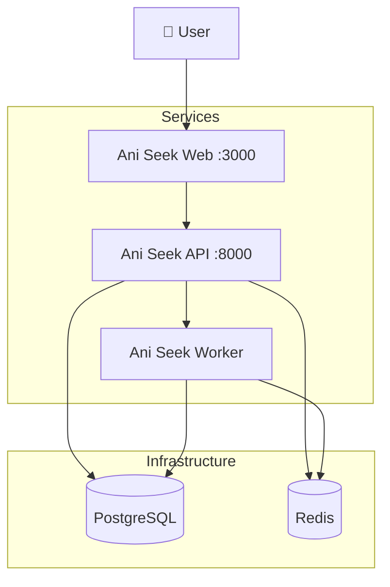
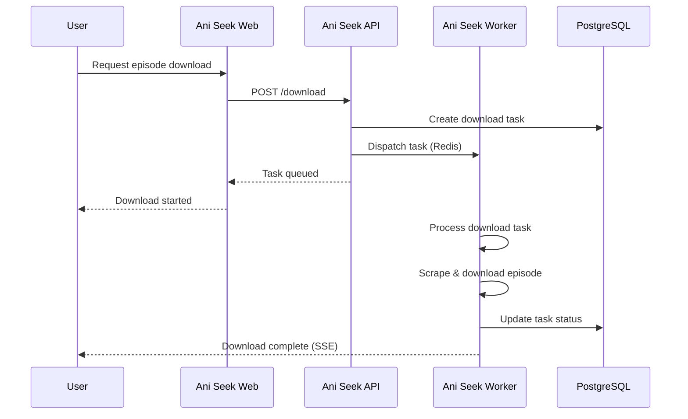

# Ani Seek

## Disclaimer

This project is intended for **educational purposes only**. The scraping functionality is designed to work with anime sources that permit such access. Users are responsible for ensuring compliance with applicable laws and the terms of service of the websites being scraped. The author assumes no liability for any misuse of this software.

## Author

- [Jonathan García](https://github.com/ElPitagoras14) - Computer Science Engineer

## Description

Ani Seek is a comprehensive system for scraping, managing, and downloading anime content. This monorepo is structured around three main components:

- **Ani Seek Web**: Frontend web application built with React + Vite. Provides the user interface for browsing, searching, and managing anime content.
- **Ani Seek API**: Backend REST API built with FastAPI. Handles authentication, data management, and dispatches scraping tasks to workers.
- **Ani Seek Worker**: Background processing service built with Dramatiq. Handles heavy operations like web scraping and episode downloads.

## Demo

<video src="https://github.com/user-attachments/assets/c6555beb-edcf-4ed9-956c-2a3472832024" controls width="100%"></video>

## Features

- **Search** — search anime by title with live scraping from AnimeAV1
- **Save** — bookmark animes to your personal list for quick access
- **Calendar** — see your saved animes currently in emission, organized by day of the week
- **Downloads** — download individual episodes or entire seasons in bulk, with real-time progress via Server-Sent Events
- **Download history** — browse and manage all your downloaded episodes
- **Storage** — monitor disk usage per anime and delete stored episodes
- **Dashboard** — overview of download stats, recent episodes, and storage consumption
- **Profile** — update your username and password

## Technologies

- **Backend**: Python, FastAPI, PostgreSQL, Redis, Dramatiq, ani-scrapy
- **Frontend**: React, Vite, TypeScript, TanStack Router, TanStack Query, shadcn/ui
- **DevOps**: Docker, Docker Compose, GitHub Actions

## Architecture


```mermaid
flowchart TB
    User[👤 User]

    subgraph Services
        Web[Ani Seek Web :3000]
        API[Ani Seek API :8000]
        Worker[Ani Seek Worker]
    end

    subgraph Infrastructure
        DB[(PostgreSQL)]
        Redis[(Redis)]
    end

    User --> Web
    Web --> API

    API --> Worker
    API --> DB
    API --> Redis

    Worker --> DB
    Worker --> Redis
```

## Download Flow


```mermaid
sequenceDiagram
    participant User
    participant Web as Ani Seek Web
    participant API as Ani Seek API
    participant Worker as Ani Seek Worker
    participant DB as PostgreSQL

    User->>Web: Request episode download
    Web->>API: POST /download
    API->>DB: Create download task
    API->>Worker: Dispatch task (Redis)
    API-->>Web: Task queued
    Web-->>User: Download started

    Worker->>Worker: Process download task
    Worker->>Worker: Scrape & download episode
    Worker->>DB: Update task status
    Worker-->>User: Download complete (SSE)
```

## Configuration

All configuration lives in `.env`. Copy the template and edit it — every variable is listed and commented there:

```bash
cp .env.example .env
```

Before any internet-facing deployment, at minimum change:

- `SECRET_KEY` — JWT signing secret, use a long random string
- `API_URL` — URL where the API is reachable **from your browser** (e.g. `http://your-server:8000`)

Two behaviors worth knowing, since they are not obvious from the config file:

> Setting `AUTH_ENABLED=false` disables the login screen entirely — useful for local development or trusted single-user setups.

> **Default admin account**: on first startup the API automatically creates an `admin` user with password `admin123`. If `AUTH_ENABLED=true`, log in and change both the username and password from the **Profile** page as soon as possible.

> User management and franchise administration are planned for a future release.

## Quick Start

**Prerequisites**: [Docker](https://docs.docker.com/get-docker/) and Docker Compose.

Every option starts the same way — create your `.env` (see [Configuration](#configuration)) — and ends the same way: the app is available at **http://localhost:3000**.

### Option 1 — Docker with GHCR images (recommended)

Uses pre-built images from GitHub Container Registry. No local build required. Copy `compose.yaml` and `.env.example` to your machine — the migrations ship inside the images, so nothing else is needed — then:

```bash
docker compose up -d
```

### Option 2 — Docker with local builds

Builds all images from source. Useful for testing local changes.

```bash
git clone https://github.com/ElPitagoras14/aniseek.git
cd aniseek
docker compose -f compose.dev.yaml up -d
```

### Option 3 — Local development

Runs each service natively with only PostgreSQL and Redis in Docker.

**Extra prerequisites**: [uv](https://docs.astral.sh/uv/getting-started/installation/), [pnpm](https://pnpm.io/installation), [VS Code](https://code.visualstudio.com/)

```bash
# install dependencies
cd backend  && uv sync && cd ..
cd worker   && uv sync && cd ..
cd frontend && pnpm install && cd ..

# start infrastructure only
docker compose -f compose.dev.yaml up aniseek-db aniseek-redis -d
```

Then launch the three services from VS Code via **Tasks: Run Task** — `Run Backend`, `Run Dramatiq`, and `Run Frontend`.

## Testing

The backend has an automated test suite covering the atomicity of its
transactional paths. It requires Docker running — the suite provisions its own
ephemeral PostgreSQL database (schema built via the dbmate migrations under
`dbmate/migrations/`) and tears it down when it finishes, successfully or not.

```bash
cd backend
uv run pytest
```

No other setup is needed: the suite does not use the development database, Redis,
or the network.

## Upgrading

Starting from this version, the database schema is managed by [dbmate](https://github.com/amacneil/dbmate) migrations under `dbmate/migrations/`, applied automatically by a one-shot `aniseek-migrate` service before the API and worker start. `postgres/init.sql` no longer exists.

The migrations ship inside the `ghcr.io/elpitagoras14/aniseek-migrate` image, published with the same version as the other services, so a deployment needs nothing on the host but `compose.yaml` and `.env`.

**The dbmate version is pinned to `2.35.0` on purpose.** That image is rebuilt on every version bump, so an untagged base would quietly pull a different dbmate into the one startup step that writes to the database. Four places declare the version — `dbmate/Dockerfile`, `compose.dev.yaml`, `backend/tests/conftest.py`, and the `pg_dump` command below — and `grep -rn "amacneil/dbmate"` finds them all. Raising dbmate means changing all four together; the natural moment to consider it is the commit that bumps the service versions, since that same commit is what triggers the rebuild.

That image also carries the `pg_dump` used to generate `dbmate/schema.sql`, and `pg_dump` must be at or above the server version — today `18.4` against `postgres:18.1-alpine`. With the version pinned this no longer resolves itself, so **raising the Postgres version means checking that the pinned image's client still reaches it**, and bumping dbmate along with it if it doesn't.

**If your deployment already mounted the migrations directory** (`./db:/db`, or an absolute path like `/dokploy-bk/aniseek/db:/db`), **remove that mount** when you move to the new image. Leaving it in place would shadow the packaged migrations with whatever is on the host — the migration step would still succeed, with the wrong files.

**If you're upgrading an existing deployment created before this change**, dbmate needs to be told that the schema it already has matches the first migration, without re-running any SQL. Do this once, **before** pulling the new images:

1. Back up your database.
2. **Recommended**: verify your schema actually matches `dbmate/schema.sql` before assuming it does. Dump it with the same tool dbmate uses internally, so the comparison isn't skewed by a different `pg_dump` version:

   ```bash
   docker run --rm --entrypoint pg_dump ghcr.io/amacneil/dbmate:2.35.0 \
     --schema-only --no-owner --no-privileges "<your DB_URL>?sslmode=disable" \
     > real-schema.sql
   ```

   Diff it against `dbmate/schema.sql` — if you don't have the repository on the host, pull it out of the migrations image itself:

   ```bash
   docker run --rm --entrypoint cat ghcr.io/elpitagoras14/aniseek-migrate:latest \
     /db/schema.sql > expected-schema.sql
   ```

   (Ignore the `\restrict` line and the `schema_migrations` table/insert at the end — those are dbmate-only bookkeeping the real dump won't have.) Any other difference means your schema drifted from `init.sql` at some point and needs reconciling before continuing.
3. Connect to the database and register the first migration as already applied:

   ```sql
   CREATE TABLE IF NOT EXISTS public.schema_migrations (version varchar PRIMARY KEY);
   INSERT INTO public.schema_migrations (version) VALUES ('0001');
   ```

4. Pull and start the new version as usual (`docker compose up -d`). The `aniseek-migrate` service will find nothing pending and exit successfully; the API and worker start right after it.

Skipping step 3 makes `aniseek-migrate` fail with a "relation already exists" error on the first migration, which blocks the API and worker from starting — no data is affected, but the app stays down until the table above is created.

New deployments don't need any of this: the schema is built entirely from the migrations on first start.

**If your deployment never set `AUTH_ENABLED`**: starting from this version, an unset `AUTH_ENABLED` makes the frontend require login, matching what the backend has always enforced. Previously an unset value silently disabled the login screen while the API still rejected every request. If you rely on running without login, set `AUTH_ENABLED=false` explicitly before upgrading.

## Deployment

This project is designed for **local or self-hosted deployment** and does not include HTTPS natively.

For internet-facing deployments:

- Place the services behind a reverse proxy (Nginx, Traefik, Caddy) that handles TLS termination
- Or use [Cloudflare Tunnel](https://developers.cloudflare.com/cloudflare-one/connections/connect-networks/) for a zero-config HTTPS setup
- Set `SECRET_KEY` to a long random value and change the default admin credentials
